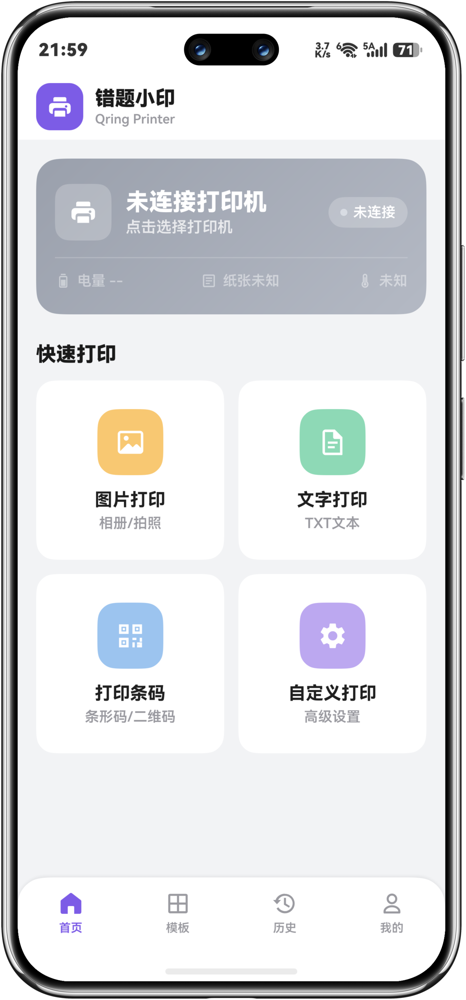
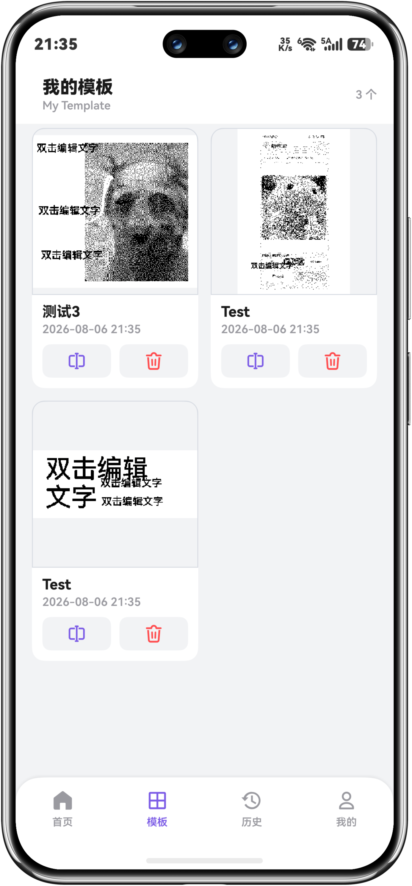
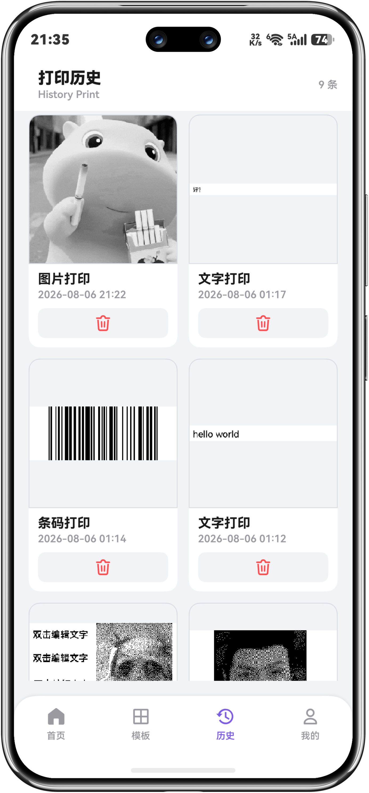
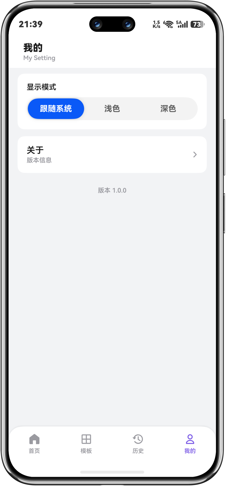
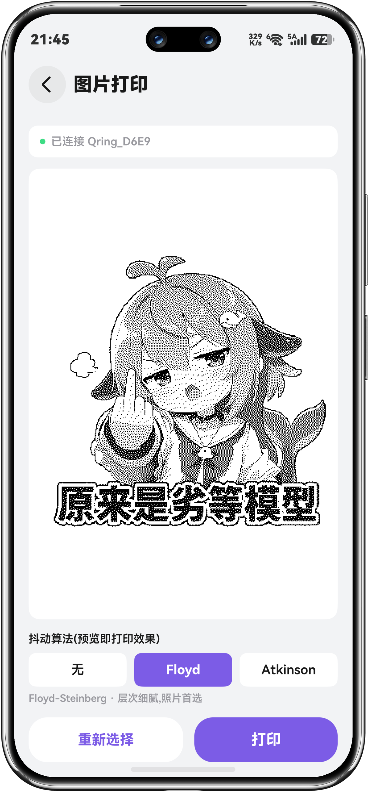
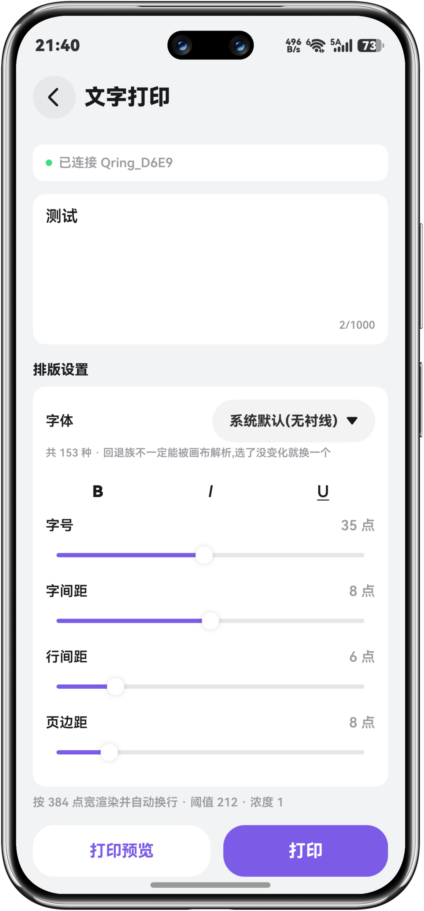
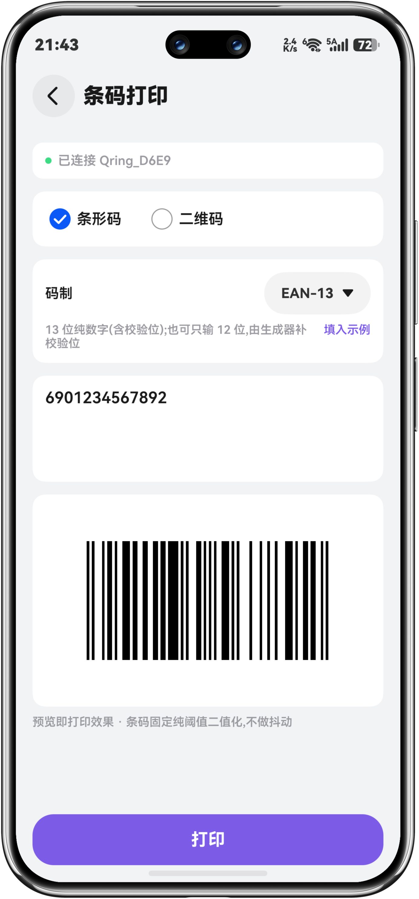
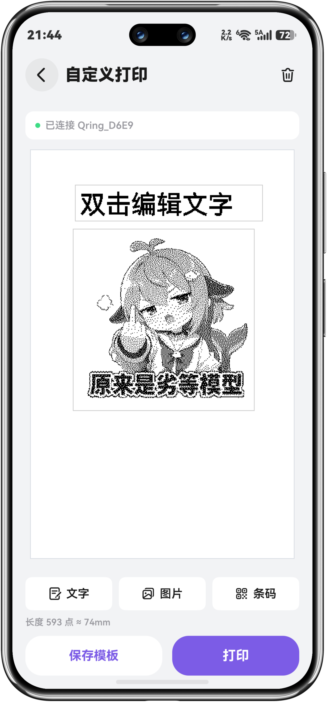

# QringPrint

**面向错题小印（Qring / BeePrt BY 系列）58mm 蓝牙热敏打印机的第三方 Android 客户端**

QringPrint Android 是基于 https://github.com/Thisko/QrintPrint HarmonyOS 客户端进行二次开发的 Android 应用。项目延续原版的本地打印思路，并针对 Android 平台重新实现界面、蓝牙连接及相关功能，无需依赖原厂服务器即可使用。

   

---

## 项目简介

错题小印（Qring / BeePrt BY 系列）是一类适用于错题整理、学习笔记、便签和标签打印的 58mm 蓝牙热敏打印机。由于原厂 App 的部分在线服务已不可用，本项目提供一个可独立运行的第三方 Android 客户端，让现有设备能够继续使用。

本项目并非原版 HarmonyOS 客户端，而是基于 https://github.com/Thisko/QrintPrint 的功能设计与实现思路进行二次开发的 Android 版本。应用通过经典蓝牙 SPP 通道与打印机直连，在本地处理文字、图片、条码及排版内容，并按照设备通信协议发送打印数据。整个打印流程不依赖云端服务，主要功能均在 Android 设备本地完成。

### 核心能力

- **原生 Android 应用**：使用 Kotlin 开发，针对 Android 平台重新实现界面与功能。
- **基于原版二次开发**：参考 Thisko/QrintPrint HarmonyOS 客户端的功能设计与打印实现思路。
- **蓝牙直连打印**：通过经典蓝牙 SPP 连接错题小印系列打印机，无需原厂服务器。
- **多种内容类型**：支持文字、图片、条码以及自由画布组合排版。
- **打印前预览**：发送任务前查看实际版面，降低纸张浪费和排版错误。
- **图片二值化处理**：针对热敏打印场景提供图像处理与抖动选项，改善灰度图片的打印效果。
- **模板与历史记录**：可保存常用版式并复用，同时保留打印历史，方便重复打印。
- **设备状态读取**：支持读取缺纸、开盖、过热、低电量和打印中等状态。
- **本地优先**：内容排版、图像处理和打印任务均在本地完成。

### 适用场景

- 学生错题、知识点和学习笔记打印
- 临时便签、待办事项及清单打印
- 二维码、条形码和简单标签打印
- 旧设备在原厂服务不可用后的继续使用
- Android 蓝牙热敏打印与私有协议研究

## 关于开发

本项目是在 https://github.com/Thisko/QrintPrint HarmonyOS 客户端基础上进行二次开发的 Android 版本。感谢原作者 Thisko 提供的开源项目及相关实现思路。

当前项目仍在持续完善中。由于可测试的 Android 设备、系统版本和打印机型号有限，可能存在兼容性或稳定性问题，不保证在所有设备上完全可用。

如果遇到问题，欢迎提交 Issue，并尽量附上手机型号、Android 版本、打印机型号、问题截图和复现步骤。若项目对你有帮助，也欢迎点一个 Star。
> 目前实现的是 **SPP** 通道,这个机器是 **SPP＋BLE** 双模的。BLE 应该也能控制,后续可以开发做小程序版。

## 功能

**打印**

- **文字打印**:字体 / 字号 / 加粗·斜体·下划线 / 字间距 / 行间距排版设置,实时预览
- **图片打印**:阈值 / Floyd-Steinberg / Atkinson 三种二值化模式,支持原图与打印效果对比预览
- **条码打印**:一维码 / 二维码,内容校验,防抖生成预览
- **自定义画布**:插入文字 / 图片 / 条码,拖拽移动、手柄缩放、双击编辑,可保存为模板

**可靠性**

- 电量 / 缺纸 / 开盖 / 过热实时监测,打印前自动体检拦截故障
- 打印期间暂停状态轮询,避免查询字节混入打印数据流
- 冷启动自动重连上次设备

**本地数据**

- 模板保存 / 加载 / 重命名
- 打印历史持久化(含缩略图),一键重新打印

## 界面（仅展示浅色页）

### 一级界面

| 首页 | 模版 | 历史 | 我的 |
| :--: | :--: | :--: | :--: |
|  |  |  |  |

### 二级界面

| 照片打印 | 文本打印 | 条码打印 | 自定义打印 |
| :--: | :--: | :--: | :--: |
|  |  |  |  |

## 技术实现

几个值得一提的地方:

### Qring 私有协议(非标准 ESC/POS)

不依赖官方 SDK。打印机的状态查询、电量、浓度等走的是自己的 `10 FF` 系列命令,**只有走纸(`ESC J`)和光栅位图(`GS v 0`)两条沿用了 ESC/POS**。协议是通过对 `com.zxxk.xiaoyin.App`(错题小印)的分析整理得到的。

- 状态字节单字节承载五个位:打印中 / 开盖 / 缺纸 / 低电压 / 过热
- 每包最大 1024 字节,包间 1ms
- 光栅编码:每行 48 字节(384 点 / 8),MSB first,**置 1 = 黑**

> 核心文件:`bluetooth/QringProtocol.ets`

### 三种二值化模式

阈值二值化、Floyd-Steinberg 误差扩散、Atkinson 误差扩散,**纯计算实现,不依赖任何图像库**,输出二值数据交给光栅层打包。切换算法时复用已解码的灰度数据,不重复解码。图片页可在原图和打印效果之间切换对比。

> 核心文件:`bluetooth/Dither.ets`

### 逐元素二值化再 OR 合并

画布上图片要 Floyd、文字要阈值 212、条码要阈值 128 且不能抖动——拍平到一张灰度再统一二值化会毁掉其中两类。做法是每个元素独立二值化,再 OR 合并到一张 384 点宽的二值画布。

> 核心文件:`common/ElementRender.ets`

### 离屏画布的单位陷阱

离屏画布默认用 vp 单位,3 倍屏上 `384vp` 会画成 1152px,出来就不是 384 点宽。用 `LengthMetricsUnit.PX` 建画布,灰度化时再加一道宽度兜底缩放,保证点阵与打印头逐点对应。

> 核心文件:`bluetooth/RasterEncoder.ets`

### 全量 V2 状态装饰器

打印机状态需要跨组件共享,全项目统一用 `@ObservedV2` / `@ComponentV2`(V1 / V2 混用是已知坑),状态卡 / 宫格 / 打印页各处实时联动。

### 命令行可独立构建

不依赖 IDE,`hvigorw` 直接出 HAP(见下方构建)。

## 项目结构

```
entry/src/main/ets/
├── bluetooth/        蓝牙连接与协议层
│   ├── PrinterDiscovery.ets   扫描、配对列表、设备名过滤
│   ├── PrinterConnection.ets  SPP 连接态机、分包收发、持久化重连
│   ├── QringProtocol.ets      私有协议:命令常量、状态位解析
│   ├── RasterEncoder.ets      图片解码、灰度化、光栅打包
│   ├── Dither.ets             三种抖动算法(纯计算)
│   └── BtPermission.ets       蓝牙权限申请
├── common/           通用层
│   ├── Theme.ets             设计令牌(颜色 / 尺寸 / 字号)
│   ├── ElementRender.ets     元素二值化与 OR 合并
│   ├── FontList.ets          字体列表
│   └── SafeArea.ets          安全区适配
├── model/            状态与数据模型
│   ├── PrinterStatus.ets     @ObservedV2 全局打印机状态
│   ├── CanvasModel.ets       画布文档模型(打印点坐标)
│   ├── TemplateStore.ets     模板持久化
│   └── HistoryStore.ets      打印历史持久化
├── pages/
│   └── Index.ets             单 @Entry + Navigation 路由
└── view/              页面与组件
    ├── HomePage.ets / PrinterStatusCard.ets / QuickActionGrid.ets
    ├── TextPrintPage.ets / ImagePrintPage.ets / CodePrintPage.ets
    ├── CustomPrintPage.ets / CanvasElementView.ets / ElementEditSheets.ets
    ├── TemplatePage.ets / HistoryPage.ets / MinePage.ets
    └── DevicePickerSheet.ets
```

## 构建

**环境要求**

- DevEco Studio 6.x(HarmonyOS SDK 6.1.1 / API 24)
- 设备:错题小印系列 58mm 蓝牙热敏打印机,手机 / 平板

**步骤**

1. 克隆仓库后用 DevEco Studio 打开
2. 在 `File → Project Structure → Signing Configs` 配置你自己的签名(`build-profile.json5` 已被 `.gitignore` 排除,含本地签名配置)
3. 连接设备,Run

命令行构建:

```bash
cd <项目根> && \
"<DevEco 安装目录>/tools/node/node.exe" \
"<DevEco 安装目录>/tools/hvigor/bin/hvigorw.js" \
assembleHap --no-daemon
```

## 常见问题

**连不上打印机?** 先确认手机蓝牙已开启、`ACCESS_BLUETOOTH` 权限已授予;设备需处于配对列表或扫描发现范围。设备名带 `Qring` 前缀的会被默认过滤选中。

**打印出来模糊 / 偏淡?** 图片打印时选合适的抖动算法(文字 / 图表用阈值模式更好),或调高打印浓度设置。

**状态读数不准?** 协议非标准 ESC/POS,状态为轮询获取(间隔 10s);打印前会现查一次,以实际结果为准。

**能支持 BLE 吗?** 机器是 SPP＋BLE 双模,目前实现的是 SPP 通道,BLE 通道待开发。

## 参与贡献

欢迎 Issue 和 PR。提 Bug 时麻烦附上手机型号、HarmonyOS 版本和复现步骤。

## 免责声明

QringPrint 是个人开发的第三方客户端,与错题小印官方无关。打印机通信协议是通过对官方 App 的分析整理得到的,**仅供学习参考,严禁商用**;如你认为此实现侵害了你的权益,请联系作者下架。

## 开源协议

[MIT License](LICENSE) © 2026 Thisko

---

Made with ❤️ by **Claude & DeepSeek**
